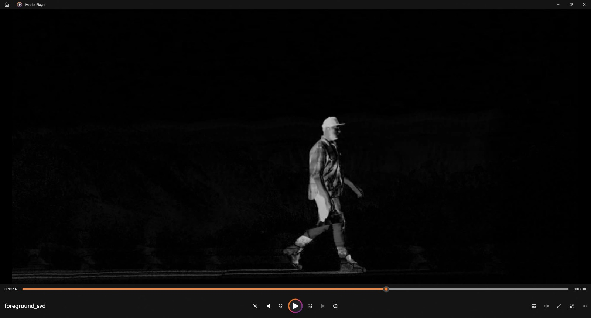

# Lampiran Makalah Aljabar Linier dan Geometri

### Citra Asli

### Hasil Ekstraksi Background (Low-Rank Approximation)

### Hasil Ekstraksi Foreground (Residual)

Repository ini berisi **lampiran pendukung** untuk makalah mata kuliah **Aljabar Linier dan Geometri**.

## Informasi Penulis
- **Nama**: Muhammad Haris Putra Sulastianto  
- **NIM**: 13524053  
- **Program Studi**: Teknik Informatika  
- **Institusi**: Institut Teknologi Bandung  

## Deskripsi
Lampiran ini digunakan untuk mendukung penjelasan pada makalah utama melalui materi tambahan seperti visualisasi, ilustrasi, atau implementasi terkait konsep Aljabar Linier dan Geometri.

## Video Penjelasan
Tautan video pendukung:  
https://youtu.be/gWIvOMXuv2k